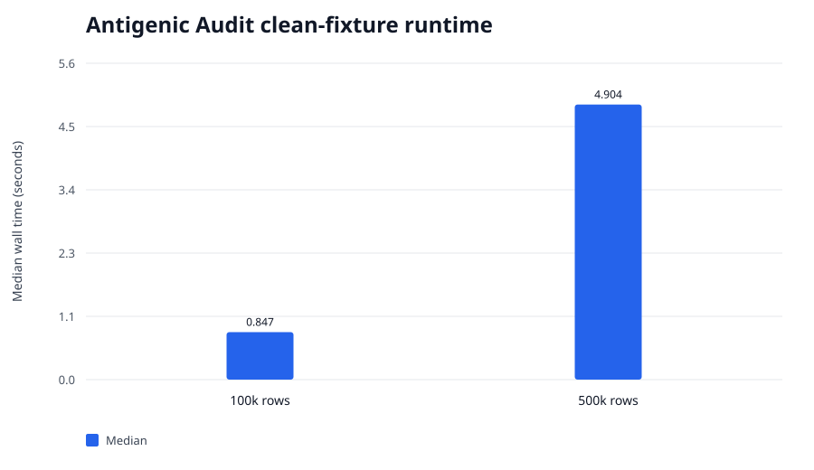

# Synthetic evaluation-audit benchmark — 2026-09-03

This benchmark measures structural audit behavior on deterministic synthetic pair-evaluation
tables. It does not validate an influenza model, biological measurements, or surveillance utility.

## Environment and source

- Host: Apple M2 Max (`Mac14,6`), 12 logical CPUs, 96 GiB RAM, macOS-14.7.6-arm64-arm-64bit, Python 3.12.7, Rust/Cargo 1.98.1
- Antigenic Audit commit: `01f9108ff3b0ccff3872846cb411f9eadebe6e4e`
- Working tree: clean
- Replicates: three independent complete harness invocations

## Results

Clean cases used disjoint, strictly forward test-virus entities under the `prospective` policy. The
leaky case reused a development virus in test and violated the chronological boundary. All clean
cases were accepted; all deliberately leaky cases returned the documented audit-failure code 2.

Times and peak RSS are medians with observed three-run ranges in brackets.

| Case | Rows | Wall time, s | Peak RSS, MiB | Expected behavior |
|---|---:|---:|---:|---|
| Clean prospective | 100,000 | 0.847 [0.844–0.874] | 102.4 [102.1–102.8] | accepted in 3/3 runs |
| Clean prospective | 500,000 | 4.904 [4.899–4.928] | 485.8 [470.2–505.6] | accepted in 3/3 runs |
| Deliberately leaky | 100,000 | 0.872 [0.857–0.873] | 109.5 [102.0–114.7] | rejected in 3/3 runs |



The 500,000-row clean case completed in a median 4.90 seconds, about
101,951 rows per second, with median peak RSS
486 MiB. Memory growth remains an optimization opportunity.

## Limitations

- Identifiers, years, responses, predictions, and leakage are synthetic.
- The benchmark exercises structural prospective-policy checks, not phylogenetic independence,
  strain-alias normalization, assay comparability, or model validity.
- One deliberately leaky row is sufficient for the negative fixture; this does not measure recall
  across a taxonomy of naturally occurring data problems.
- No competing leakage-audit implementation was benchmarked.

## Reproduction

```bash
python3 -u benchmark.py run --profile standard --label antigenic-audit-r1 --tool antigenic-audit
```
